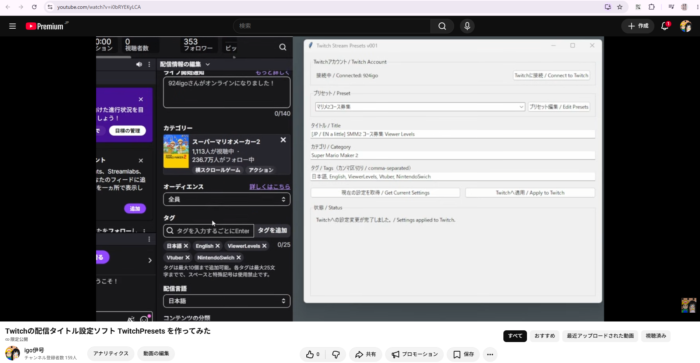
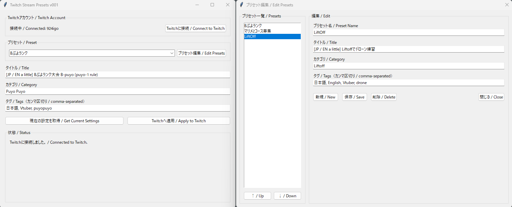

# Twitch Stream Presets

Twitchの配信タイトル、カテゴリ、タグを、あらかじめ登録したプリセットから簡単に切り替えるためのデスクトップアプリです。

A desktop application for quickly applying predefined Twitch stream titles, categories, and tags.

---

## Demo / デモ動画

アプリの使用例はこちらです。

Watch a short demonstration of the application:

[](https://www.youtube.com/watch?v=i0bRYEKyLCA)

---

## Author / 作者

Made by igo（伊号）

- Twitch: https://www.twitch.tv/924igo
- YouTube: http://youtube.com/@igo_game
- Twitter (X): https://x.com/924igo

## Features / 主な機能

- 配信タイトルのプリセット切り替え
- Twitchカテゴリの切り替え
- タグの切り替え
- 現在のTwitch配信設定の取得
- プリセットの追加・編集・削除
- プリセットの表示順変更
- Twitch OAuthによるアカウント認証
- Access Tokenの検証
- Refresh Tokenによる自動更新
- Windows向け実行ファイルの配布

The application supports:

- Stream title presets
- Twitch category presets
- Twitch tag presets
- Retrieving current Twitch stream settings
- Adding, editing, and deleting presets
- Reordering presets
- Twitch OAuth authentication
- Access token validation
- Automatic token refresh
- Standalone Windows executable

---

## Screenshot / スクリーンショット

アプリのメイン画面です。

Main application window:


---

## Installation / インストール

### Windows executable

Pythonをインストールしていない場合は、GitHub Releases(https://github.com/igo4online/TwitchStreamPresets/releases/tag/Release )からWindows用実行ファイルをダウンロードしてください。

1. Open the Releases page.
2. Download the latest Windows executable.
3. Run the downloaded `.exe` file.
4. Click `Twitchに接続 / Connect to Twitch`.
5. Complete the Twitch authorization process in your browser.
6. Return to the application and select a preset.
7. Click `Twitchへ適用 / Apply to Twitch`.

No Twitch Developer configuration is required for normal users.

---

## First Launch / 初回起動

初回起動時には、Twitchアカウントとの接続が必要です。

`Twitchに接続 / Connect to Twitch` を押すと、ブラウザでTwitchの認証ページが開きます。

Twitch上でこのアプリへのアクセスを許可すると、アプリがUser Access Tokenを取得し、以後のTwitch APIアクセスに使用します。

The application uses Twitch's Device Code OAuth flow.
Users do not need to manually configure a Client ID, Client Secret, or redirect URI.

---

## Twitch Permissions / Twitch権限

このアプリは以下のOAuth scopeを要求します。

```text
channel:manage:broadcast
```

この権限は、Twitchチャンネルの配信情報を変更するために使用されます。

Specifically, this application uses this permission to update:

- Stream title
- Twitch category
- Stream tags

The application does not request unrelated permissions such as chat moderation, subscriptions, or private messages.

---

## Presets / プリセット

プリセットには以下の情報が保存されます。

- Preset name
- Stream title
- Twitch category
- Twitch category ID
- Tags

Example:

```json
{
  "Example Preset":{
    "title":"Example stream title",
    "game":"Just Chatting",
    "game_id":"509658",
    "tags":[
      "English"
    ]
  }
}
```

`game_id` is stored internally to reduce unnecessary Twitch API requests.
Users normally do not need to know or edit the category ID directly.

---

## Local Files / ローカル保存ファイル

実行時に、アプリと同じディレクトリに以下のファイルが作成されます。

The following files are created in the same directory as the application when needed.

```text
token.json
presets.json
```

### token.json

Twitch OAuthの認証情報が保存されます。

This file stores Twitch OAuth authentication information.

以下の情報が含まれる場合があります。

It may contain:

- Access Token
- Refresh Token

このファイルには、Twitchアカウントへのアクセスに使用される認証情報が含まれるため、他人と共有しないでください。

Because this file contains authentication information used to access your Twitch account, do not share it with other people.

また、このファイルをGitHubやその他の公開ストレージへアップロードしないでください。

Do not upload this file to GitHub or any other public storage.

### presets.json

ユーザーが作成・編集したプリセット情報が保存されます。

This file stores user-defined preset information.

通常、このファイルにはTwitchの認証情報は含まれませんが、配信タイトルやタグなど、個人的な設定内容が含まれる場合があります。

This file does not normally contain Twitch authentication credentials, but it may contain personal stream titles, tags, or other configuration information.

---

## Security / セキュリティ

このアプリは、TwitchのPublic ClientとDevice Code Flowを使用して認証を行います。

This application uses Twitch's Public Client and Device Code Flow for authentication.

アプリ内にはTwitch Client Secretは含まれていません。

The application does not contain a Twitch Client Secret.

ソースコード内に含まれているClient IDは秘密情報ではなく、公開されても問題ありません。

The Client ID included in the source code is not considered secret and may be publicly distributed.

一方、以下の情報は秘密情報として扱う必要があります。

However, the following information must be kept private:

```text
token.json
access_token
refresh_token
```

各ユーザーのTwitch Tokenは、そのユーザー自身がアプリを認証した後に、そのユーザーのPC上で生成されます。

Each user's Twitch tokens are generated locally on that user's computer after the user authorizes the application.

開発者が各ユーザーのAccess TokenやRefresh Tokenを受け取ったり、管理したりする必要はありません。

The developer does not need to receive or manage individual users' Access Tokens or Refresh Tokens.

---

## Running from Source / ソースコードから実行

ソースコードから実行する場合は、以下の環境が必要です。

The following environment is required to run the application from source.

Requirements:

- Python 3
- tkinter
- requests

`requests` がインストールされていない場合は、以下を実行してください。

If `requests` is not installed, run:

```bash
pip install requests
```

その後、以下のコマンドでアプリを起動できます。

Then start the application with:

```bash
python main.py
```

以下のPythonファイルは、同じディレクトリに配置してください。

Place the following Python files in the same directory:

```text
main.py
config.py
twitch_api.py
presets.py
gui.py
```

---

## File Structure / ファイル構成

基本的なファイル構成は以下のようになります。

The basic file structure is as follows:

```text
TwitchStreamPresets/
├─ main.py
├─ config.py
├─ twitch_api.py
├─ presets.py
├─ gui.py
├─ Screenshot.png
├─ presets.json
└─ token.json
```

`presets.json` と `token.json` は、必要になった時点で自動生成されます。

`presets.json` and `token.json` are generated automatically when needed.

`Screenshot.png` はREADME上で表示するためのスクリーンショットです。

`Screenshot.png` is used to display the application screenshot in the README.

---

## Building the Windows Executable / Windows実行ファイルの作成

Windows向けの単体実行ファイルは、PyInstallerを使用して作成できます。

A standalone Windows executable can be created using PyInstaller.

PyInstallerがインストールされていない場合は、以下を実行してください。

If PyInstaller is not installed, run:

```bash
pip install pyinstaller
```

`main.py` が存在するディレクトリで、以下を実行します。

Run the following command in the directory containing `main.py`:

```bash
pyinstaller --onefile --noconsole --name TwitchStreamPresets main.py
```

生成された実行ファイルは、以下の場所に作成されます。

The generated executable will be created at:

```text
dist/TwitchStreamPresets.exe
```

---

## Notes about Windows SmartScreen / Windows SmartScreenについて

GitHub Releasesから配布する実行ファイルには、コード署名が付与されていない場合があります。

The executable distributed through GitHub Releases may be unsigned.

その場合、Windows SmartScreenやアンチウイルスソフトによって警告が表示される可能性があります。

In that case, Windows SmartScreen or antivirus software may display a warning when the executable is launched.

この警告は、必ずしもアプリが悪意のあるソフトウェアであることを意味するものではありません。

This warning does not necessarily mean that the application is malicious.

実行ファイルに不安がある場合は、GitHub上のソースコードを確認し、Pythonから直接実行することもできます。

If you are concerned about the executable, you can review the source code on GitHub and run the application directly from Python instead.

---

## Supported Platforms / 対応プラットフォーム

現在は主にWindows上で動作確認を行っています。

The application is currently tested primarily on Windows.

現在確認している環境:

Currently tested primarily on:

- Windows

Pythonソースコードはtkinterを使用しているため、macOS上でも動作する可能性があります。

Because the Python source code uses tkinter, it may also work on macOS.

ただし、macOS向けの`.app`形式で配布する場合は、macOS上で別途ビルドおよび動作確認を行う必要があります。

However, packaged macOS `.app` builds should be created and tested separately on macOS.

---

## Limitations / 制限事項

このアプリには、現時点で以下の制限があります。

The application currently has the following limitations:

- Twitchとの通信にはインターネット接続が必要です。  
  Internet access is required to communicate with Twitch.

- Twitch APIの仕様変更により、将来的に動作しなくなる可能性があります。  
  Twitch API behavior may change in the future.

- カテゴリ名は、Twitch上に存在する有効なカテゴリ名である必要があります。  
  Twitch category names must correspond to valid Twitch categories.

- Twitch側でアプリの認証を解除した場合、OAuth Tokenが無効になることがあります。  
  OAuth tokens may become invalid if Twitch authorization is revoked.

- Tokenの状態によっては、Twitchへの再認証が必要になる場合があります。  
  In some cases, reauthentication may be required.

---

## Privacy / プライバシー

このアプリは、プリセット情報やTwitchの認証Tokenを、開発者が運用するサーバへ送信することを意図していません。

This application does not intentionally send preset data or Twitch authentication tokens to any server operated by the developer.

Twitch APIに関する通信は、原則としてアプリとTwitchのサービスとの間で直接行われます。

Communication related to the Twitch API is performed directly between the application and Twitch services.

`token.json` と `presets.json` は、ユーザーのPC上にローカル保存されます。

`token.json` and `presets.json` are stored locally on the user's computer.

---

## License / ライセンス

This project is licensed under the MIT License.

MIT Licenseのもとで公開しています。詳細は `LICENSE` ファイルを参照してください。

---

## Disclaimer / 免責事項

このプロジェクトは、Twitch Interactive, Inc.とは独立した非公式ツールです。

This project is an independent, unofficial tool.

Twitch Interactive, Inc.による提供、承認、スポンサーを受けたものではありません。

It is not affiliated with, endorsed by, or sponsored by Twitch Interactive, Inc.

Twitchおよび関連する商標は、それぞれの権利者に帰属します。

Twitch and related trademarks are the property of their respective owners.
